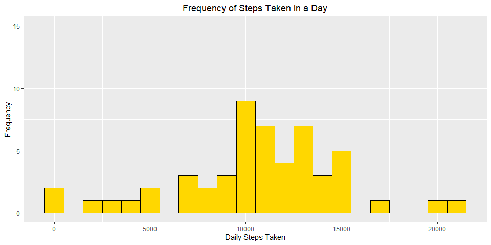
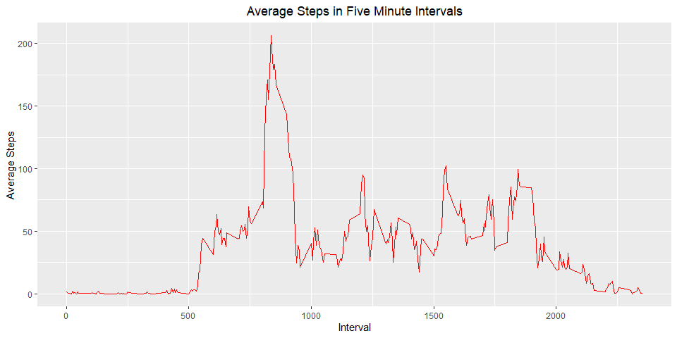
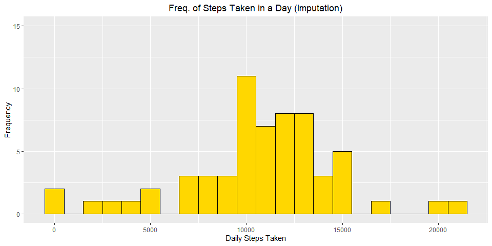
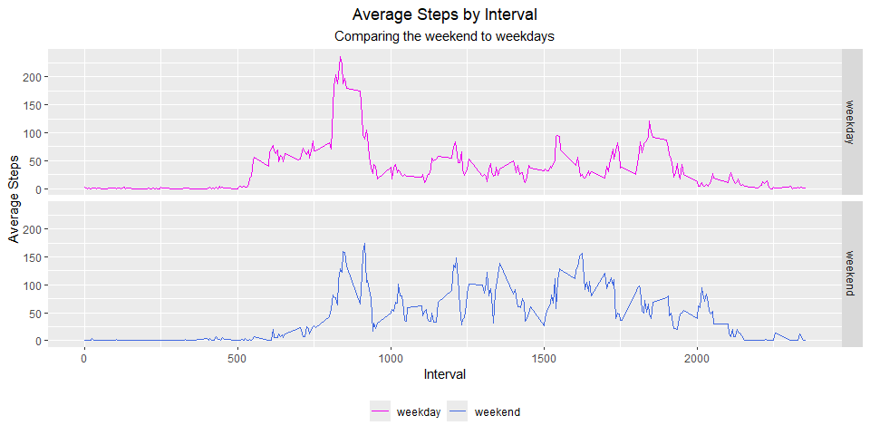

It is now possible to collect a large amount of data about personal movement using activity monitoring devices such as a Fitbit,  
Nike Fuelband, or Jawbone Up. These type of devices are part of the “quantified self” movement – a group of enthusiasts who take   
measurements about themselves regularly to improve their health, to find patterns in their behavior, or because they are tech geeks.    
But these data remain under-utilized both because the raw data are hard to obtain and there is a lack of statistical methods and   
software for processing and interpreting the data.

This assignment makes use of data from a personal activity monitoring device. This device collects data at 5 minute intervals   
through out the day. The data consists of two months of data from an anonymous individual collected during the months of October   
and November, 2012 and include the number of steps taken in 5 minute intervals each day.

The data for this assignment can be downloaded from the course web site:

* Dataset:  Activity monitoring data [52K]

The variables included in this dataset are:

* steps: Number of steps taking in a 5-minute interval (missing values are coded as NA)

* date: The date on which the measurement was taken in YYYY-MM-DD format

* interval: Identifier for the 5-minute interval in which measurement was taken

The dataset is stored in a comma-separated-value (CSV) file and there are a total of 17,568 observations in this dataset.

NOTE: The GitHub repository also contains the dataset for the assignment so you do not have to download the data separately.

<br>
<br>

#### Loading libraries

``` r
knitr::opts_chunk$set(echo = TRUE, warning = FALSE, fig.width = 10, 
		      fig.height = 5, fig.keep = 'all', 
		      dev = 'png')
library(ggplot2)
library(dplyr)
```

#### Loading and preprocessing the data


``` r
#		Unzip "activity.zip" folder
filedest <- getwd()
unzip("activity.zip", exdir = filedest)

#		Read CSV file to step_data
step_data <- read.csv("activity.csv", header = TRUE, colClasses = c("numeric", 
			"Date", "numeric"))

#		Add column for the day of the week (DOW).
step_data$DOW <- weekdays(step_data$date)         

#		Create data set of complete cases.
step_data_complete <- step_data[complete.cases(step_data),]

#		Create data frame of rows with NAs.
step_data_na <- step_data[!complete.cases(step_data),]                
```
   

#### What is mean total number of steps taken per day?


``` r
#       Sum steps by day.
steps_by_day <- with(step_data_complete,(aggregate(steps~date, FUN = sum, na.rm = TRUE )))

#       Plot histogram of frequency of daily steps in buckets 1000 steps wide.
histogram <- ggplot(data = steps_by_day)+
		geom_histogram(aes(x = steps), binwidth = 1000, color = "black",
			       fill = "gold")+
		ylab("Frequency")+
		ylim(0,15)+
		xlab("Daily Steps Taken")+
		ggtitle("Frequency of Steps Taken in a Day")+
		theme(plot.title = element_text(hjust = 0.5))
print(histogram)
```

<!-- -->

``` r
#       Calculate the mean of the daily steps.
mean(steps_by_day$steps)
```

```
## [1] 10766.19
```

``` r
#       Calculate the median of the daily steps.
median(steps_by_day$steps)              
```

```
## [1] 10765
```

#### What is the average daily activity pattern?


``` r
#       Find mean steps by interval.
mean_steps_by_int <- with(step_data,(aggregate(steps~interval, FUN = mean, na.rm = TRUE)))


#       Plot a time series of the mean steps by interval across 
#       all days that have records.
tseries <- ggplot(data = mean_steps_by_int, aes(interval, steps))+
		geom_line(col = "red")+
		ggtitle("Average Steps in Five Minute Intervals")+
		ylab("Average Steps")+
		xlab("Interval")+
		theme(plot.title = element_text(hjust = 0.5))
print(tseries)
```

<!-- -->

``` r
#       Find the interval with the maximum average steps across
#       all days that have records.
mean_steps_by_int[which.max(mean_steps_by_int$steps), ]          
```

```
##     interval    steps
## 104      835 206.1698
```


#### Imputing missing values


``` r
#       Calculate the total number of missing values in the original data set.
colSums(is.na(step_data))[1:3]
```

```
##    steps     date interval 
##     2304        0        0
```

``` r
#       Calculate the mean steps by interval and weekday (DOW) of complete cases.
mean_steps_by_int <- with(step_data_complete,(aggregate(steps~interval + DOW, FUN = mean, na.rm = TRUE)))

#       Merge replacement value column for NA values with mean steps for 
#       corresponding interval and day of week. Remove NA column. Rename 
#       replacement column. Reorder columns to match original data set.
step_data_imputed <- merge(step_data_na, mean_steps_by_int, by = c("interval", "DOW"))

step_data_imputed <- step_data_imputed[,-3]

names(step_data_imputed)[4] <- "steps"

step_data_imputed <- step_data_imputed[,c("steps","date","interval","DOW")]

#       Merge rows of complete cases and imputed cases.
step_data_backfill <- rbind(step_data_complete, step_data_imputed)

steps_by_day_backfill <- with(step_data_backfill,(aggregate(steps~date, FUN = sum, na.rm = TRUE )))


#       Plot histogram of frequency of daily steps in buckets 1000 steps wide
#       with imputed values included. 
histogram <- ggplot(data = steps_by_day_backfill)+
        geom_histogram(aes(x = steps), binwidth = 1000, color = "black",
                       fill = "gold")+
        ylab("Frequency")+
        ylim(0,15)+
        xlab("Daily Steps Taken")+
        ggtitle("Freq. of Steps Taken in a Day (Imputation)")+
        theme(plot.title = element_text(hjust = 0.5))
print(histogram)
```

<!-- -->

``` r
#	Calculate new mean and median with imputed data included.
mean(steps_by_day_backfill$steps)
```

```
## [1] 10821.21
```

``` r
median(steps_by_day_backfill$steps)
```

```
## [1] 11015
```


#### Are there differences in activity patterns between weekdays and weekends?


``` r
#	Create weekday and weekend vectors.
wday <- c("Monday", "Tuesday", "Wednesday","Thursday" , "Friday")
wend <- c( "Saturday" , "Sunday")

#	Create new column in data set.
step_data_backfill2 <-  step_data_backfill %>% 
			mutate(DOW.Type = ifelse(DOW %in% wday, "weekday", "weekend"))
	
#	Coerce new column to factor instead of character.	
step_data_backfill2$DOW.Type <- as.factor(step_data_backfill2$DOW.Type)

#	Calculate the mean steps by interval and type of day (DOW.Type).
steps_by_day_backfill2 <- with(step_data_backfill2,(aggregate(steps~interval+DOW.Type, FUN = mean, na.rm = TRUE )))
	

#	Plot the mean steps across all intervals broken out by type of day (DOW.Type).
tseries.factor <- ggplot(data = steps_by_day_backfill2)+
			geom_line(aes(x = interval, y = steps, 
				      color = factor(DOW.Type)))+
			facet_grid(DOW.Type~.)+
			scale_color_manual(values = c("weekday" = "magenta2", 
						      "weekend" = "royalblue"))+
			xlab("Interval")+
			ylab("Average Steps")+
			labs(   title = "Average Steps by Interval",
				subtitle = "Comparing the weekend to weekdays")+
			theme(legend.title = element_blank(), 
				legend.position = "bottom", 
				plot.title = element_text(hjust = 0.5),
				plot.subtitle = element_text(hjust = 0.5))

print(tseries.factor)
```

<!-- -->
